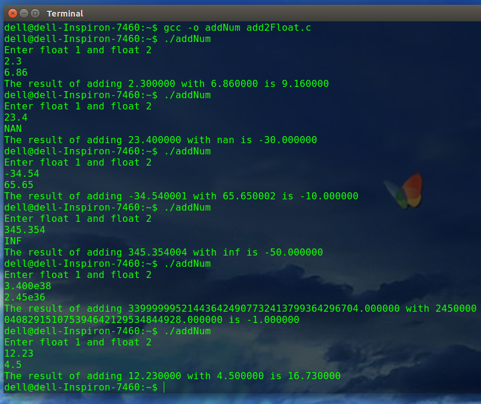

# FloatingPointAdditionSysCall

## Implmentation of System Call for FLoating Point Addition

Addition of new system call in Kernel space which adds 2 floating point numbers and returns the result to the user space.
Both floating point numbers are valid positive numbers which leads to a result as a valid floating point number. Numbers are converted to IEEE 754 floating point representation for system call.

- **Overflow on addition** :
  -   If both exponents are equal and equal to 254, then their addition is will result in exponent=255 which is either NAN or infinity. That's why -1 is returned.
  -   If both exponents are unequal and larger exponent is equal to 254 and addition of fractions is greater than (2^23), then their addition will
	 result in exponent=255 which is either NAN or infinity. That's why -1 is returned.
- If either of the number is negaitve return -10.000000 as error value 
- If exponent of float is 255 and fraction is non-zero , it is NAN. Retuns -30.000000 if second number is NAN and -40.000000 if first number is NAN
- If exponent is 255 and fraction is zero number is infinty. Returns -50.000000 if either of the number is infinite.
- For valid positive floating point numbers, first adjust fraction (1 of 1.fraction form after shifting fraction of second number according to difference of exponents and then return addition of fractional parts. System call number is 34.

## Some examples

